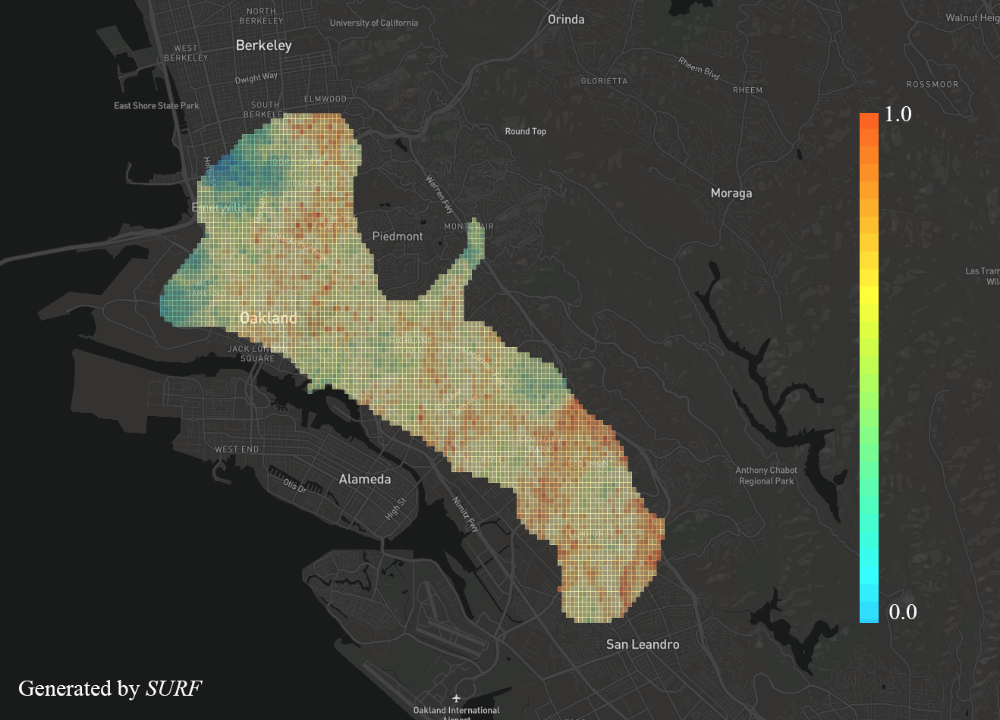

# Building Classification

This is the code for the project of *soft-story building classification*. 

The goal of this project is designing a model which can automatically classify a [soft-story building](https://en.wikipedia.org/wiki/Soft_story_building) based on a single street view image.

### Prerequisites

Tensorflow 1.0.

Python 2

CPU or NVIDIA GPU + CUDA CuDNN

### Getting Started
* step 1: Install latest version of TF-slim following the instruction [here](https://github.com/tensorflow/models/tree/master/research/slim)

* step 2: Put this repo in the foloder /models/research/slim/

* step 3: Download [pre-trained models](https://github.com/tensorflow/models/tree/master/research/slim) (ResNet50/152 or InceptionV3/V4) and put them in the folder /models/research/slim/pretrained/; download data ([Santa Monica](https://www.dropbox.com/s/huvod9jawka3ayj/Santa_Monica.tar.gz?dl=0) and 
[Oakland](https://www.dropbox.com/s/hlwcs1v3y4jq71s/Oakland.tar.gz?dl=0) and put them in /models/research/slim/tfrecords/

* step 4: Run the code.

### Training a Model

```shell
  cd /models/research/slim/
  ./finetune_resnet_50_on_buildings.sh
```  

### Evaluating a Model

Please download our trained models [here](https://berkeley.box.com/s/c9pp0teffvu3je7w93ug6xcjs3zop5iq) (923M).

```shell
  cd /models/research/slim/
  ./finetune_resnet_50_on_buildings_eval.sh
``` 

### Datasets and Results

Datasets (*SS* refers to soft-story building). All images in the datasets are collected by [Google Street View API](https://developers.google.com/maps/documentation/streetview/intro).

   | City |	# SS	|  # non-SS |   # train  | # test |
   |:-------:|:--------:| --------:| ---------:|---------:|
   | Santa Monica   | 3,203	| 3,921 | 6,421  | 712  |
   | Oakland  | 717	| 642 | 1,224  | 135  |

Performance of ResNet50 / InceptionV3 on Santa Monica / Oakland

   | Model |	avg. acc.	|  Precision |   Recall  | F1 |
   |:-------:|:--------:| --------:| ---------:|---------:|
   | ResNet50   | 85.94%	| 84.16% | 82.80%  | 83.47%  |
   | InceptionV3  | 84.38%	| 81.39% | 83.77%  | 82.56%  |
   

   | Model |	avg. acc.	|  Precision |   Recall  | F1 |
   |:-------:|:--------:| --------:| ---------:|---------:|
   | ResNet50   | 82.29%	| 81.54% | 82.81%  | 82.17%  |
   | InceptionV3  | 80.21%	| 80.65% | 78.13%  | 79.37%  |
   
Generalization ability of the models 

Note: The models are trained on Santa Monica dataset and tested on 395 street view images collected from Berkeley and San Jose. 

   | Model |	avg. acc.	|  Precision |   Recall  | F1 |
   |:-------:|:--------:| --------:| ---------:|---------:|
   | ResNet50 | 86.61% | 84.26% | 89.34% | 86.70% |
   | InceptionV3 | 87.72% | 84.26% | 92.39% | 88.14%  |

### Application
Given a specific city/region, a soft-story building distribution map can be created based on the prediction of the trained model. The below figure shows the distribution map of Oakland, which is created by [*SURF*](https://github.com/charlesxwang/SURF).




